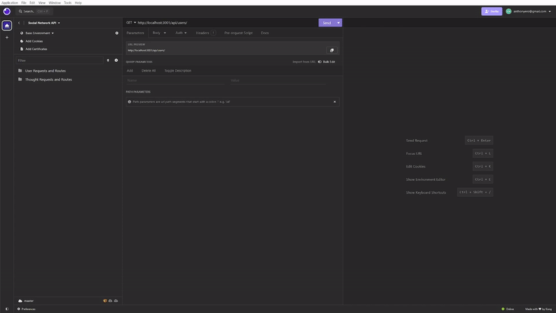
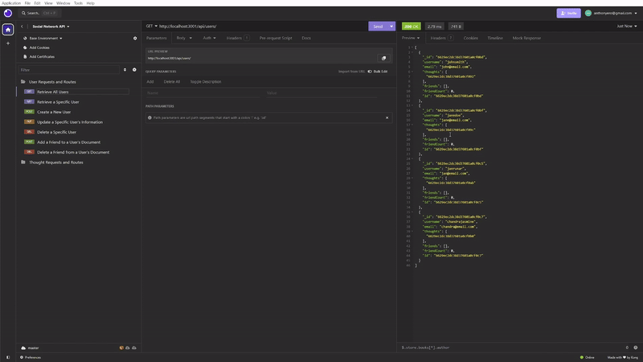

# Social Network API

An API for a social network web application where users can share their thoughts, react to friends' thoughts, and create a friend list.

Utilizes Express.js and uses Mongoose to interact with a MongoDB NoSQL database.

**Features include**:

- Allows users to create accounts by providing a username and an email address 
    - Users can update their user information
- Allows users to create new Thoughts, update previously published Thoughts, and delete Thoughts
- Allows users to publish Reactions to specific Thoughts and delete Reactions to Thoughts
- Allows users to add other users as friends and remove users from their friends list

- Provides query functionality to access the following collections within the database:
    - Users
        - **Retrieve all** users with information about their published Thoughts and their friends list
        - **Retrieve a specific** user, with the text content of their Thoughts, utilizing the users's id
        - **Add a new** user
        - **Update** a user
        - **Delete** a user
        - **Add an existing** user as a friend
        - **Delete an existing** user as a friend
    - Thoughts
        - **Retrieve all** Thoughts with their associated reactions
        - **Retrieve a specific** Thought utilizing the Thought's id
        - **Add a new** Thought with properties such as:    
            - Thought text
            - Username
        - **Update** a Thought
            - Can update the text content and published username
        - **Delete** a Thought
    - Reactions
        - **Add a new** Reaction
        - **Delete** a Reaction

This exercise was provided by Northwestern University and edX through the Coding boot camp. Submitted as fulfillment of the Module 18 exercise during the December, 2023 - June, 2024 cohort.

## Table of Contents

- [Installation](#installation)
- [Usage](#usage)
- [Links](#links)
- [Credits](#credits)
- [License](#license)

## Installation

- Prerequisites:
    - Download and install [Node.js](https://nodejs.org/en)
    - Download and install [MongoDB](https://www.mongodb.com/)

1. Download this repository's contents to your local machine utilizing the green `Code` button. 
    - The "Download ZIP" option is sufficient for installation. Ensure that you extract the folder's contents.
2. Open the downloaded directory in your preferred command-line interface. 
    - Possible options including "Terminal" on Mac, "Git Bash" on Windows, or VSCode.
3. Within the downloaded directory, run the following command: 
    > npm install 
    - This will install the Node.js packages `express` and `mongoose`, and their dependencies which are detailed in the `package.json` file.

## Usage

**For first-time users:**

1. If users are interested in populating their collections with existing data, seed data and functionality is included. Within the downloaded directory, seed your database using the following command:
    > npm run seed
    - Seed files are provided for demonstration. Feel free to update with your own, relevant data.

2. Within the downloaded directory, initiate the application by using the following command:
> npm run start

3. Utilizing software such as Insomnia or Postman, query and manipulate your database's content using the `GET`, `POST`, `PUT`, and `DELETE` routes defined in the "routes" directory.

4. Shut down the Express server by closing your terminal or using `ctrl + c`

**For returning users:**

1. Initiate the application by using the following command:
> npm run start

2. Utilize Insomnia, Postman, etc. to interact with your social network database.

3. Shut down the Express server by closing your terminal or using `ctrl + c`.

## Links

- [Link to a walkthrough video](https://drive.google.com/file/d/1nAvYv3AQpP1GomREH-EV-42khEdL8X4B/view?usp=sharing)

- [Link to the GitHub repository](https://github.com/anthonyero/social_network_api)

The relevant JavaScript files are located within this repository. 

JavaScript files include comments detailing changes implemented within them. Further justifications can also be found within the repository's "Issues" tab.

Please refer to the commit history and branches within the repository for a tracked history of changes.

## Credits

This application utilzes `Node.js`, `MongoDB`, and the `express` and `mongoose` npm packages.

Software used to test routes in the walkthrough video is [`Insomnia`](https://insomnia.rest/).

## License

N/A

